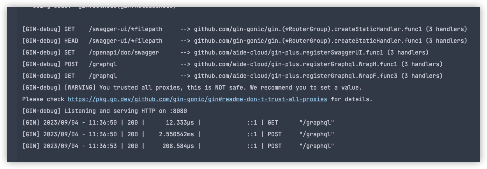

# gin plus

> 用于对gin框架增强, 实现根据结构体+结构体方法名实现路由注册、文档生成等功能

[使用示例](https://github.com/aide-cloud/gin-plus-app)

## 安装

```shell
go get -u github.com/aide-cloud/gin-plus
```

## 使用

```go
package main

import (
	"log"

	ginplush "github.com/aide-cloud/gin-plus"

	"github.com/gin-gonic/gin"
)

type People struct {
}

func (p *People) GetInfo() gin.HandlerFunc {
	return func(ctx *gin.Context) {
		ctx.String(200, "GetInfo")
	}
}

func (p *People) Middlewares() []gin.HandlerFunc {
	return []gin.HandlerFunc{
		func(context *gin.Context) {
			log.Println("middleware1")
		},
		func(context *gin.Context) {
			log.Println("middleware2")
		},
	}
}

func main() {
	r := gin.Default()
	ginInstance := ginplush.New(r, ginplush.WithControllers(&People{}))
	ginInstance.Run(":8080")
}

```

## 自定义

```go
package main

import (
	"log"
	
	ginplush "github.com/aide-cloud/gin-plus"
	
	"github.com/gin-gonic/gin"
)

// People controller, 会根据该controller的方法名注册路由
type People struct {
	// 内联controller, 方法注册到父级
    *Img 
}

// Img controller, 会根据该controller的方法名注册路由
type Img struct {
    File *File
}

// File controller, 会根据该controller的方法名注册路由
type File struct {
}

// GetImgInfo Get /imgInfo
func (l *Img) GetImgInfo() gin.HandlerFunc {
    return func(ctx *gin.Context) {
        ctx.String(200, "GetInfo")
    }
}

// GetFiles Get /files
func (l *File) GetFiles() gin.HandlerFunc {
    return func(ctx *gin.Context) {
		ctx.String(200, "GetFiles")
    }
}

// GetInfo Get /info
func (p *People) GetInfo() gin.HandlerFunc {
    return func(ctx *gin.Context) {
        ctx.String(200, "GetInfo")
    }
}

// List Get /list
func (p *People) List() gin.HandlerFunc {
    return func(ctx *gin.Context) {
        ctx.String(200, "List")
    }
}

// Middlewares 模块下公共中间件
func (p *People) Middlewares() []gin.HandlerFunc {
    return []gin.HandlerFunc{
        func(context *gin.Context) {
            log.Println("middleware1")
        },
        func(context *gin.Context) {
            log.Println("middleware2")
        },
    }
}

// BasePath People模块下公共路由前缀
func (p *People) BasePath() string {
    return "/people/v1"
}

// MethoderMiddlewares People各个方法的中间件
func (p *People) MethoderMiddlewares() map[string][]gin.HandlerFunc {
    return map[string][]gin.HandlerFunc{
        "GetInfo": {
            func(ctx *gin.Context) {
                log.Println("GetInfo middleware1")
            },
        },
    }
}

type Slice []string

func (l *Slice) Middlewares() []gin.HandlerFunc {
    return nil
}

func (l *Slice) GetInfo() gin.HandlerFunc {
    return func(ctx *gin.Context) {
        ctx.String(200, "GetInfo")
    }
}

func main() {
    r := gin.Default()
    opts := []ginplush.Option{
        // 注册全局路由
		ginplush.WithMiddlewares(func(ctx *gin.Context) {
            log.Println("main middleware")
        }),
        // 设置基础的路由前缀, 会在每个路由前面加上该前缀
		ginplush.WithBasePath("aide-cloud"),
		// 设置路由前缀, 只识别这个列表的函数, 其他函数统一以defaultHttpMethod为http方法注册
		ginplush.WithHttpMethodPrefixes(ginplush.Get, ginplush.Post),
        // 无前缀的函数默认使用的http方法
		ginplush.WithDefaultHttpMethod(ginplush.Post),
		// 路由controller, 会根据该controller的方法名注册路由
		ginplush.WithControllers(&People{
            Img: &Img{
                File: &File{},
            },
        }, &Slice{}),
    }
    ginInstance := ginplush.New(r, opts...)
    ginInstance.Run(":8080")
}
```

* 运行截图


## v0.0.6+之后

* 增加新的方法格式注入

除了上述的直接实现`gin.HandlerFunc`类型的方法可以注入之外, 从v0.0.6版本开始, 新增了`func(ctx context.Context, req *ApiReq) (*ApiResp, error)`格式的方法也能注入, 这里的req和resp可以是结构体, 也可以是结构体指针类型, 入参第一参数必须为context.Context, 出参只允许两个返回值, 且第二返回值必须为error类型

如下所示:

我们定义了一个Api的注入对象, 并增加了CRUD的四个方法, 这四个方法都为上面提到的函数格式, 完成这些后, 通过`WithControllers`方法把该对象注入到ginplus中, 从而实现`gin`路由的注册和`api`文档生成, 启动时候, 会在当前目录下生成一个`openapi.yaml`文件, 该文件就是你的注入对象所生成api文档

当然, 我们也提供了关闭生成api文档功能的开关, `ApiConfig`的`GenApiEnable`属性为`false`时候, 会关闭文档生成和文档预览功能, 通过`WithApiConfig`完成控制

```go
package main

import (
	"context"
	"log"

	ginplush "github.com/aide-cloud/gin-plus"

	"github.com/gin-gonic/gin"
)

type (
	Api struct {
	}

	ApiDetailReq struct {
		Id uint `uri:"id"`
	}

	ApiDetailResp struct {
		Id     uint   `json:"id"`
		Name   string `json:"name"`
		Remark string `json:"remark"`
	}

	ApiListReq struct {
		Current   int    `form:"current"`
		Size      int    `form:"size"`
		Keryworld string `form:"keyworld"`
	}
	ApiListResp struct {
		Total   int64          `json:"total"`
		Current int            `json:"current"`
		Size    int            `json:"size"`
		List    []*ApiInfoItem `json:"list"`
	}

	ApiInfoItem struct {
		Name   string `json:"name"`
		Id     uint   `json:"id"`
		Remark string `json:"remark"`
	}

	ApiUpdateReq struct {
		Id     uint   `uri:"id"`
		Name   string `json:"name"`
		Remark string `json:"remark"`
	}
	ApiUpdateResp struct {
		Id uint `json:"id"`
	}

	DelApiReq struct {
		Id uint `uri:"id"`
	}

	DelApiResp struct {
		Id uint `json:"id"`
	}
)

func (l *Api) GetDetail(ctx context.Context, req *ApiDetailReq) (*ApiDetailResp, error) {
	log.Println("Api.GetDetail")
	return &ApiDetailResp{
		Id:     req.Id,
		Name:   "demo",
		Remark: "hello world",
	}, nil
}

func (l *Api) GetList(ctx context.Context, req *ApiListReq) (*ApiListResp, error) {
	log.Println("Api.GetList", req)
	return &ApiListResp{
		Total:   100,
		Current: req.Current,
		Size:    req.Size,
		List: []*ApiInfoItem{
			{
				Id:     10,
				Name:   "demo",
				Remark: "hello world",
			},
		},
	}, nil
}

func (l *Api) UpdateInfo(ctx context.Context, req *ApiUpdateReq) (*ApiUpdateResp, error) {
	log.Println("Api.UpdateInfo")
	return &ApiUpdateResp{Id: req.Id}, nil
}

func (l *Api) DeleteInfo(ctx context.Context, req *DelApiReq) (*DelApiResp, error) {
	log.Println("Api.DeleteInfo")
	return &DelApiResp{Id: req.Id}, nil
}

func main() {
	r := gin.Default()
	opts := []ginplush.Option{
		// 路由controller, 会根据该controller的方法名注册路由
		ginplush.WithControllers(&Api{}),
	}
	ginInstance := ginplush.New(r, opts...)
	ginInstance.Run(":8080")
}
```

## graphql

```go
package ginplus

import (
	"embed"
	"testing"

	"github.com/gin-gonic/gin"
)

// Content holds all the SDL file content.
//
//go:embed sdl
var content embed.FS

type Root struct{}

func (r *Root) Ping() string {
	return "pong"
}

func TestGraphql(t *testing.T) {
	instance := New(gin.Default(), WithGraphqlConfig(GraphqlConfig{
		Enable:     true,
		HandlePath: "/graphql",
		ViewPath:   "/graphql",
		Root:       &Root{},
		Content:    content,
	}))

	instance.Run(":8080")
}
```




